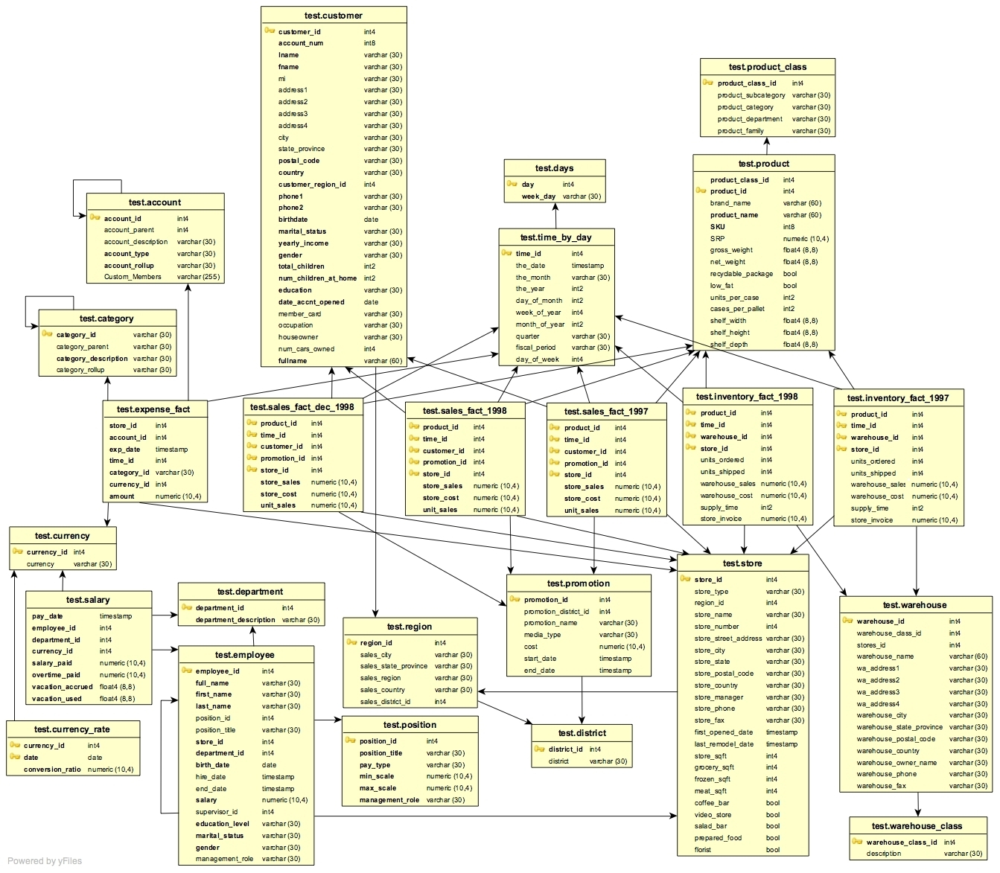

# Retail Project

## JARS:
Scroll down to the second answer
https://stackoverflow.com/questions/46434255/how-to-query-datasets-in-avro-format

2) wget http://central.maven.org/maven2/com/databricks/spark-avro_2.11/4.0.0/spark-avro_2.11-4.0.0.jar .

3)  spark-shell --jars <pathwhere you downloaded jar file>/spark-avro_2.11-4.0.0.jar

4)spark.read.format("com.databricks.spark.avro").load("s3://MYAVROLOCATION.avro")

## Here is another example for a case study:
https://github.com/NFLX-WIBD/WIBD-Workshops-2018/tree/master/Data%20Engineering

In this project, we will be migrating the existing Retail project to use the New Architecture using Spark,
Airflow and Kafka.

## Assignment
*  Find total Promotion sales generated on weekdays and weekends for each region, year & month
* Find the most popular promotion which generated highest sales in each region
## Steps Involved
* Create pySpark scripts for initial and incremental loads. The script will read sales and
promotion tables based on last_update_date column from mysql and store them in AVRO
format in S3 buckets. You might want to add a last_update_date in the tables
* A second pySpark script will read the AVRO files, filter out all non-promotion records from
input, join the promotion and sales tables and save the data in Parquet format in S3 buckets.
* The Parquet file is aggregated by regionID, promotionID, sales_year, sales_month to generate
total StoreSales for weekdays and weekends and the output is saved as a CSV file in S3
buckets.
